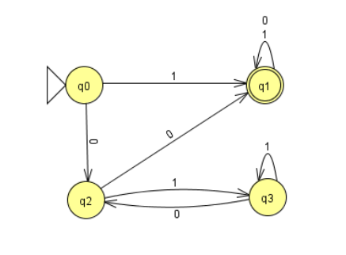

[![LinkedIn][linkedin-shield]][linkedin-url]


<!-- ABOUT THE PROJECT -->
## About The Project


This program written in C++ reads from
a file that contains the specifications of a finite automaton (FA) and then simulates the
behavior of the automaton for a series of strings that are supplied as input.
The program should be run as:

```
./automata_simulator input.fa input.txt
```

Where the two parameters passed on the command line correspond in this order
with:
A text file containing the specification of a finite automaton.
A text file with a .txt extension containing a series of strings (one
string by line) on the alphabet of the automaton specified in the first of the
files.

The finite automaton will be defined in a text file with the extension .fa. The files
.fa should have the following format:

Line 1: Alphabet symbols separated by spaces.

Line 2: Total number of states of the automaton.

Line 3: PLC startup status.

Next there will be a line for each of the states. Each line will contain
the following numbers, separated from each other by white spaces:

• State identification number. The states of the automaton will be represented
through natural numbers. The numbering of the states will correspond to the
first numbers starting at 0.

• A 1 if it is an acceptance state and a 0 otherwise.

• Number of transitions that the state has.

• Next, for each of the transitions, and using spaces in
white as separators, the following information will be detailed:

◦ Input symbol necessary for the transition to occur. I'll stop-
present the empty string (not consuming input symbol) will be used
the character &

◦ Destination state of the transition



Following the .fa file format described above, the DFA seen on the image above
would specify as follows:

0 1

4

0

0 0 2 0 2 1 1

1 1 2 0 1 1 1

2 0 2 0 1 1 3

3 0 2 0 2 1 3

<p align="right">(<a href="#readme-top">back to top</a>)</p>


### Built With


* ![C++][C++.js]

<p align="right">(<a href="#readme-top">back to top</a>)</p>


<!-- GETTING STARTED -->
## Getting Started

### Prerequisites

None

### Installation

No installation required :)

<p align="right">(<a href="#readme-top">back to top</a>)</p>


<!-- USAGE EXAMPLES -->
## Usage

1. Makefile included. Use it with command **make** to compile the files and you are ready!


<p align="right">(<a href="#readme-top">back to top</a>)</p>


<!-- LICENSE -->
## License

Distributed under the MIT License.

<p align="right">(<a href="#readme-top">back to top</a>)</p>


<!-- CONTACT -->
## Contact

Joel Óscar - josc.margut@gmail.com

<p align="right">(<a href="#readme-top">back to top</a>)</p>


<!-- MARKDOWN LINKS & IMAGES -->
<!-- https://www.markdownguide.org/basic-syntax/#reference-style-links -->
[contributors-shield]: https://img.shields.io/github/contributors/github_username/repo_name.svg?style=for-the-badge
[contributors-url]: https://github.com/github_username/repo_name/graphs/contributors
[forks-shield]: https://img.shields.io/github/forks/github_username/repo_name.svg?style=for-the-badge
[forks-url]: https://github.com/github_username/repo_name/network/members
[stars-shield]: https://img.shields.io/github/stars/github_username/repo_name.svg?style=for-the-badge
[stars-url]: https://github.com/github_username/repo_name/stargazers
[issues-shield]: https://img.shields.io/github/issues/github_username/repo_name.svg?style=for-the-badge
[issues-url]: https://github.com/github_username/repo_name/issues
[license-shield]: https://img.shields.io/github/license/github_username/repo_name.svg?style=for-the-badge
[license-url]: https://github.com/github_username/repo_name/blob/master/LICENSE.txt
[linkedin-shield]: https://img.shields.io/badge/-LinkedIn-black.svg?style=for-the-badge&logo=linkedin&colorB=555
[linkedin-url]: https://www.linkedin.com/in/joel-%C3%B3scar-mart%C3%ADn-guti%C3%A9rrez-578ab8303
[product-screenshot]: images/screenshot.png
[Next.js]: https://img.shields.io/badge/next.js-000000?style=for-the-badge&logo=nextdotjs&logoColor=white
[Next-url]: https://nextjs.org/
[C++.js]: https://img.shields.io/badge/-C++-blue?logo=cplusplus
[React.js]: https://img.shields.io/badge/React-20232A?style=for-the-badge&logo=react&logoColor=61DAFB
[React-url]: https://reactjs.org/
[Vue.js]: https://img.shields.io/badge/Vue.js-35495E?style=for-the-badge&logo=vuedotjs&logoColor=4FC08D
[Vue-url]: https://vuejs.org/
[Angular.io]: https://img.shields.io/badge/Angular-DD0031?style=for-the-badge&logo=angular&logoColor=white
[Angular-url]: https://angular.io/
[Svelte.dev]: https://img.shields.io/badge/Svelte-4A4A55?style=for-the-badge&logo=svelte&logoColor=FF3E00
[Svelte-url]: https://svelte.dev/
[Laravel.com]: https://img.shields.io/badge/Laravel-FF2D20?style=for-the-badge&logo=laravel&logoColor=white
[Laravel-url]: https://laravel.com
[Bootstrap.com]: https://img.shields.io/badge/Bootstrap-563D7C?style=for-the-badge&logo=bootstrap&logoColor=white
[Bootstrap-url]: https://getbootstrap.com
[JQuery.com]: https://img.shields.io/badge/jQuery-0769AD?style=for-the-badge&logo=jquery&logoColor=white
[JQuery-url]: https://jquery.com 
